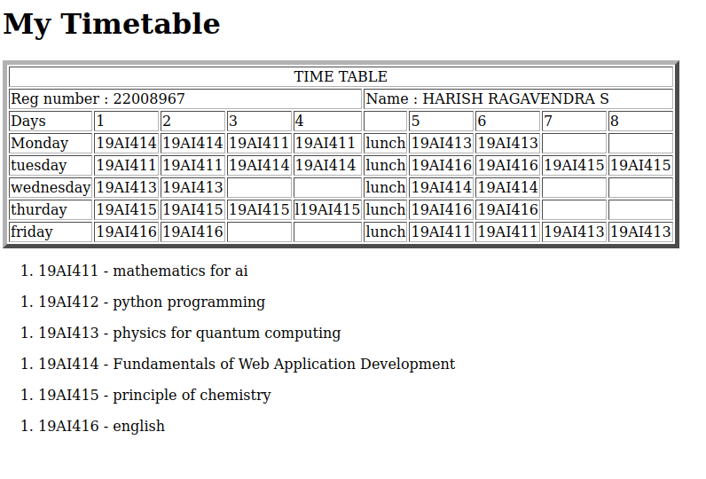

# Experiment_Time_Table

## AIM
To Write a html webpage page to display your timetable.

# ALGORITHM
### STEP 1
create a simple table using table tag
### STEP 2
Add header row using th tag
### STEP 3
Add your timetable
### STEP 4
Execute the program

# CODE
```
<!DOCTYPE html>
<html>
    <head>
        <title>timetable</title>
    </head>
    <body>
        <!DOCTYPE html>
<html lang="en">
    <head>
        <title>My Timetable</title>
    </head>
    <body>
        <h1>My Timetable</h1>
        <table border="5">
            <tr>
                <td align="center" colspan="10">TIME TABLE</td>
            </tr>
            <tr>
                <td colspan="5">Reg number : 22008967</td>
                <td colspan="5">Name : HARISH RAGAVENDRA S</td>
             

            </tr>
            <tr>
                <td>Days</td>
                <td>1</td>
                <td>2</td>
                <td>3</td>
                <td>4</td>
                <td></td>
                <td>5</td>
                <td>6</td>
                <td>7</td>
                <td>8</td>
            </tr>
            <tr>
                <td>Monday</td>
                <td>19AI414</td>
                <td>19AI414</td>
                <td>19AI411</td>
                <td>19AI411</td>
                <td>lunch</td>
                <td>19AI413</td>
                <td>19AI413</td>
                <td></td>
                <td></td>
            </tr>
            <tr>
                <td>tuesday</td>
                <td>19AI411</td>
                <td>19AI411</td>
                <td>19AI414</td>
                <td>19AI414</td>
                <td>lunch</td>
                <td>19AI416</td>
                <td>19AI416</td>
                <td>19AI415</td>
                <td>19AI415</td>
            </tr>
            <tr>
                <td>wednesday</td>
                <td>19AI413</td>
                <td>19AI413</td>
                <td></td>
                <td></td>
                <td>lunch</td>
                <td>19AI414</td>
                <td>19AI414</td>
                <td></td>
                <td></td>
            </tr>
            <tr>
                <td>thurday</td>
                <td>19AI415</td>
                <td>19AI415</td>
                <td>19AI415</td>
                <td>l19AI415</td>
                <td>lunch</td>
                <td>19AI416</td>
                <td>19AI416</td>
                <td></td>
                <td></td>
            </tr>
            <tr>
                <td>friday</td>
                <td>19AI416</td>
                <td>19AI416</td>
                <td></td>
                <td></td>
                <td>lunch</td>
                <td>19AI411</td>
                <td>19AI411</td>
                <td>19AI413</td>
                <td>19AI413</td>
            </tr>

        </table>
        <ol>
            <li>19AI411 - mathematics for ai</li>
        </ol>
        <ol>
            <li>19AI412 - python programming </li>
        </ol>
        <ol>
            <li>19AI413 - physics for quantum computing</li>
        </ol>
        <ol>
            <li>19AI414 - Fundamentals of Web Application Development</li>
        </ol>
        <ol>
            <li>19AI415 - principle of chemistry</li>
        </ol>
        <ol>
            <li>19AI416 - english</li>
        </ol>
    </body>
</html>
    </body>
</html>

```

# OUPUT

result:
thus the experiment excuted sucessfully
